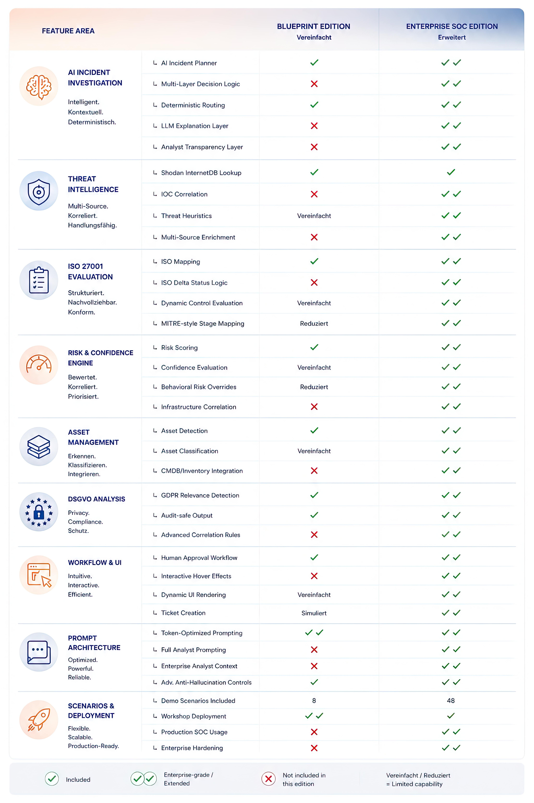

# Intelligent Security Incident Processing Platform

> AI-driven incident triage for Security Operations Centers — from raw event to audit-ready decision, with a human always in the loop.

*Scroll down for the German version / Deutsche Version weiter unten.*

---

## Executive Summary

The Intelligent Security Incident Processing Platform automates security incident handling end-to-end — from initial detection to a decision-ready assessment.

Incoming events are transformed into structured data and evaluated against a clearly defined decision framework. This reduces false positives while ensuring relevant incidents are reliably identified.

By combining deterministic processing with targeted expert validation, the platform delivers incident assessments that are consistent, transparent, and fully auditable — making security operations faster, more scalable, and easier to govern.

  

<em>Community Blueprint vs. Enterprise Edition — same decision engine, different depth of integration.</em>

---

## Overview

This solution implements an end-to-end, AI-powered workflow for analyzing, assessing, and processing security incidents within a Security Operations Center (SOC).

Its goal: automatically structure incoming security events, classify them in their operational context, and derive consistent, transparent, and explainable decisions.

The architecture deliberately separates three responsibilities:

| Layer | Responsibility |
|---|---|
| **Ingest & Normalization** | Data preparation |
| **Topic & Context** | Business interpretation |
| **AI Incident Planner** | Decision logic |

---

## Process Overview

### 1. Scenario Setup *(Test Environment Only)*
Initializes input data for demonstration and testing. An analyst can be preassigned so all subsequent user tasks are automatically routed — no manual **Assign To Me** needed.

### 2. Incident Scenario Selection *(Test Environment Only)*
Selects a predefined demo or test scenario to simulate a security incident.

### 3. AI Incident Analysis & Decision Engine
The central decision-making component:
- Processes structured security events
- Selects the required investigation tools
- Prepares the subsequent investigation workflow

### 4. AI Investigation Tools *(Dynamic)*
Executed automatically based on incident type:
- Threat Intelligence Lookup
- Asset Infrastructure Lookup
- GDPR Relevance Assessment

### 5. Security Incident Validation *(Human-in-the-Loop)*
A SOC analyst validates the automated assessment:
- Confirms final impact and priority
- Verifies the technical assessment
- Optionally adds analyst comments

### 6. Security Incident Report
Automatically generated, containing:
- Incident summary
- Technical analysis
- Compliance assessment (e.g. GDPR)
- Recommended response actions

---

## Core Architectural Principles

1. **Structured data instead of raw logs** — the AI Incident Planner processes only structured event data (JSON), never uncontrolled raw logs.
2. **Deterministic topic generation** — every event type maps to a unique incident topic via predefined rules.
3. **Clear separation of responsibilities** — Ingest (technical prep), Topic Engine (business classification), Planner (decision making).
4. **Human-in-the-loop validation** — a SOC analyst reviews every automated decision to minimize false classifications.
5. **Auditability** — every decision is transparent, documented, traceable, and fully auditable.

---

## AI Incident Planner

The central decision engine of the platform. It:
- Analyzes the incident context
- Determines the required investigation activities
- Selects the appropriate investigation tools

All outputs are generated as strictly structured JSON, ensuring deterministic downstream processing.

---

## Supported Investigation Tools

**Threat Intelligence Lookup**
Checks IP addresses and external indicators against known threat intelligence sources.

**Asset Infrastructure Lookup**
Identifies internal systems, evaluates their business criticality, and determines responsible organizational units.

**GDPR Relevance Assessment**
Determines whether an incident involves personal data and whether GDPR obligations may apply.

---

## Integration with Operational Systems

Validated security incidents can be forwarded to downstream platforms such as ServiceNow. Only verified incidents are transferred — false positives are filtered out beforehand.

---

## Vision

The platform enables organizations to:
- Reduce manual investigation effort
- Deliver consistent and reproducible incident assessments
- Detect relevant security incidents early
- Maintain fully auditable documentation aligned with ISO 27001 and GDPR

---

## Guiding Principle

**Structured data leads to clear decisions.**
**Clear decisions lead to secure processes.**

---
---

# Intelligent Security Incident Processing Platform

> KI-gestützte Incident-Triage für Security Operations Center — vom Rohereignis bis zur revisionssicheren Entscheidung, immer mit fachlicher Kontrolle.

## Executive Summary

Die Intelligent Security Incident Processing Platform automatisiert die Verarbeitung von Sicherheitsvorfällen — von der Erkennung bis zur entscheidungsfähigen Bewertung.

Eingehende Ereignisse werden strukturiert aufbereitet und anhand einer klar definierten Entscheidungslogik bewertet. Das reduziert Fehlalarme und stellt sicher, dass relevante Vorfälle zuverlässig erkannt werden.

Durch die Kombination aus deterministischer Verarbeitung und gezielter fachlicher Validierung entstehen konsistente, nachvollziehbare und revisionssichere Incident-Bewertungen — Sicherheitsprozesse werden dadurch effizienter, transparenter und deutlich skalierbarer.

  

<em>Community Blueprint vs. Enterprise Edition — dieselbe Entscheidungslogik, unterschiedliche Integrationstiefe.</em>

---

## Überblick

Diese Lösung implementiert einen durchgängigen, KI-gestützten Prozess zur Analyse, Bewertung und Verarbeitung von Sicherheitsvorfällen im Kontext eines Security Operations Centers (SOC).

Ziel: eingehende Sicherheitsereignisse automatisiert strukturieren, fachlich einordnen und daraus konsistente, nachvollziehbare Entscheidungen ableiten.

Die Architektur trennt bewusst drei Verantwortlichkeiten:

| Ebene | Verantwortung |
|---|---|
| **Ingest & Normalisierung** | Datenaufbereitung |
| **Topic & Kontext** | Fachliche Interpretation |
| **AI Incident Planner** | Entscheidungslogik |

---

## Prozessübersicht

### 1. Scenario Setup *(nur Test-Environment)*
Initialisierung der Eingangsdaten. Ein Bearbeiter kann vorbelegt werden, sodass nachfolgende User Tasks automatisch zugewiesen werden — „Assign To Me" entfällt.

### 2. Incident Scenario Selection *(nur Test-Environment)*
Auswahl eines Demo- oder Test-Szenarios zur Simulation eines Sicherheitsvorfalls.

### 3. AI Incident Analysis & Decision Engine
Zentrale Entscheidungsinstanz:
- Verarbeitung strukturierter Events
- Auswahl notwendiger Analyse-Tools
- Vorbereitung der weiteren Untersuchung

### 4. AI Investigation Tools *(dynamisch)*
Abhängig vom Incident automatisch ausgeführt:
- Threat Intelligence Lookup
- Asset Infrastructure Lookup
- DSGVO-Relevanzprüfung

### 5. Security Incident Validation *(Human-in-the-Loop)*
Ein SOC-Analyst validiert die automatisierte Bewertung:
- finale Einstufung von Impact und Dringlichkeit
- fachliche Absicherung der Entscheidung
- optionale Ergänzung von Kommentaren

### 6. Security Incident Report
Automatisch generiert, mit:
- Incident-Zusammenfassung
- technischer Analyse
- Compliance-Bewertung (z. B. DSGVO)
- empfohlenen Maßnahmen

---

## Zentrale Architekturprinzipien

1. **Struktur statt Rohdaten** — der AI Incident Planner verarbeitet ausschließlich strukturierte Events (JSON), keine unkontrollierten Logdaten.
2. **Deterministische Topic-Erzeugung** — jeder Event-Typ wird über feste Regeln in ein eindeutiges Incident-Topic überführt.
3. **Klare Trennung der Verantwortlichkeiten** — Ingest (technische Aufbereitung), Topic Engine (fachliche Einordnung), Planner (Entscheidung).
4. **Human-in-the-Loop** — jede automatisierte Entscheidung wird durch einen SOC-Analyst validiert, um Fehlklassifikationen zu vermeiden.
5. **Revisionssicherheit** — alle Entscheidungen sind nachvollziehbar, dokumentiert und auditierbar.

---

## AI Incident Planner

Die zentrale Entscheidungsinstanz im System. Er:
- analysiert den Incident-Kontext
- entscheidet über notwendige Untersuchungsschritte
- steuert die Auswahl der Analyse-Tools

Die Ausgabe erfolgt strikt strukturiert (JSON) und ermöglicht so eine deterministische Weiterverarbeitung.

---

## Unterstützte Analyse-Tools

**Threat Intelligence Lookup**
Prüft IP-Adressen und externe Quellen gegen bekannte Bedrohungsdaten.

**Asset Infrastructure Lookup**
Erkennt interne Systeme, deren Kritikalität und verantwortliche Organisationseinheiten.

**DSGVO-Relevanzprüfung**
Bewertet, ob ein Vorfall personenbezogene Daten betrifft und regulatorische Maßnahmen erforderlich sind.

---

## Integration in operative Systeme

Validierte Sicherheitsvorfälle können in nachgelagerte Systeme (z. B. ServiceNow) überführt werden. Nur bestätigte Incidents werden weitergegeben — Fehlalarme werden vorher aussortiert.

---

## Zielbild

Die Plattform ermöglicht:
- Reduktion manueller Analyseaufwände
- konsistente und reproduzierbare Incident-Bewertung
- frühzeitige Erkennung relevanter Sicherheitsvorfälle
- revisionssichere Dokumentation gemäß ISO 27001 und DSGVO

---

## Leitsatz

**Strukturierte Daten führen zu klaren Entscheidungen.**
**Klare Entscheidungen führen zu sicheren Prozessen.**
